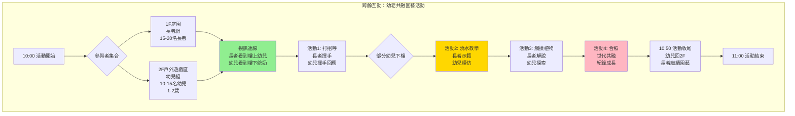

# 赤土崎全齡社福樞紐 - 24小時服務時間軸與空間原型

**專案代號**: 114年新竹政策黑客松
**文件類型**: 實施規劃 - 時間軸設計
**完成日期**: 2025-10-23
**基於文件**:
- 日本24H臨托案例研究
- 建築樓層配置詳細設計
- 竹科家庭需求分析

---

## 📊 一、24小時服務時間軸總覽

### 視覺化時間軸（全日）

```
時間 →  00  02  04  06  08  10  12  14  16  18  20  22  24
════════════════════════════════════════════════════════════════

🏢 B1 停車場
        ████████████████████████████████████████████  [24H開放]
        ▲              ▲              ▲              ▲
      夜班送托        日照接送        托育接送        青少年

🏢 1F 長照日照中心
        ░░░░░░██████████████████████░░░░░░░░░░░░░░░
                ↑                  ↑
              09:00              17:00
        [長者服務時段 9:00-17:00]

        特殊時段：
        • 08:30-09:00  家屬送托報到
        • 11:30-12:30  午餐時段
        • 12:30-14:00  午休時段
        • 16:30-17:00  家屬接回時段

🏢 2F 公共托嬰中心
        ░░░░███████████████████░░░░░░░░░░░░░░░░░░░
            ↑                 ↑
          07:30             17:30
        [嬰幼兒托育 7:30-17:30]

        🌙 夜間臨托試辦（周五、六）
        ░░░░░░░░░░░░░░░░░░░░░█████████████░░░░░░
                              ↑          ↑
                            19:00      07:00

        特殊時段：
        • 11:00-11:45  嬰兒組午餐
        • 11:45-12:30  幼兒組午餐
        • 12:00-14:30  午睡時段

🏢 3F 家庭支持服務中心
        ░░░░░░░░░░░░░░░░░░███████████████░░░░░░░░
                          ↑            ↑
                        18:00        21:00
        [平日晚間服務 18:00-21:00]

        假日：
        ░░░░░░░░░░██████████████████████████░░░░░░
                  ↑                        ↑
                09:00                    21:00

        特殊時段：
        • 11:00-13:00  社區共餐（假日）
        • 18:30-20:30  親職講座（平日）
        • 19:00-21:00  諮商服務

🏢 4F 青少年活動中心
        ░░░░░░░░░░░░░░░░░░░░░░░░░░░░░░███████░░░░
                                      ↑      ↑
                                    17:00  21:00
        [平日課後 17:00-21:00]

        假日：
        ░░░░░░░░░░░░░░░██████████████████████░░░░░
                        ↑                    ↑
                      13:00                21:00

        特殊時段：
        • 17:00-18:30  自習/運動高峰
        • 18:30-19:00  晚餐時段（3F供餐）
        • 19:00-21:00  課程/活動時段

════════════════════════════════════════════════════════════════
```

---

## ⏰ 二、關鍵時段深度分析

### 時段A：深夜至清晨 (00:00-06:00)

#### 空間使用狀態
```
┌─────────────────────────────────────────────────┐
│ 時段A：00:00-06:00 深夜至清晨                    │
├─────────────────────────────────────────────────┤
│ B1  停車場        ▓ 值班警衛1名                  │
│                   ▓ 夜間臨托家長車輛(3-5輛)      │
├─────────────────────────────────────────────────┤
│ 1F  長照中心      ░ 關閉（清潔消毒）             │
│                   ░ 安全監控啟動                 │
├─────────────────────────────────────────────────┤
│ 2F  托嬰中心      ▓ 夜間臨托進行中（試辦）       │
│     • 睡眠室      ▓ 8名幼兒睡眠監測              │
│     • 值班室      ▓ 2名保育員輪流值班            │
│     • 監視系統    ▓ 呼吸監測器全開               │
│                   ▓ 每15分鐘巡視記錄             │
├─────────────────────────────────────────────────┤
│ 3F  家庭支持      ░ 關閉                         │
├─────────────────────────────────────────────────┤
│ 4F  青少年中心    ░ 關閉                         │
└─────────────────────────────────────────────────┘

使用人數：8-10人（幼兒8名 + 保育員2名）
能源狀態：
  • 2F睡眠室：空調維持24-26°C、監視系統運作
  • 其他樓層：最低運轉模式（安全照明+監控）
  • B1：緊急照明 + 值班室照明
```

#### 夜間臨托作息表（2F）
```
時間軸：
21:00 ─┬─ 最後1名幼兒入睡
       │   • 保育員A完成巡視記錄
       │   • 確認呼吸監測器運作正常
       │
22:00 ─┤   • 保育員A、B輪流休息（值班室）
       │   • 維持至少1名保育員清醒監視
       │
23:00 ─┤   • 每15分鐘巡視記錄
       │   • 檢查：呼吸、肤色、姿勢、室溫
       │
00:00 ─┤   • 保育員交接班（確認所有幼兒狀態）
       │   • 檢查監視器錄影正常
       │
02:00 ─┤   • 個別幼兒可能夜醒（喝奶、換尿布）
       │   • 安撫後繼續睡眠
       │
04:00 ─┤   • 部分幼兒開始淺眠
       │   • 保育員準備起床活動
       │
06:00 ─┴─ 起床時段開始
           • 依幼兒自然醒來時間彈性處理
```

---

### 時段B：清晨準備 (06:00-09:00)

#### 空間使用狀態
```
┌─────────────────────────────────────────────────┐
│ 時段B：06:00-09:00 清晨準備                      │
├─────────────────────────────────────────────────┤
│ B1  停車場        ▓ 逐漸湧入車輛                 │
│                   ▓ 尖峰時段 08:00-09:00         │
│                   ▓ 親子車位優先使用             │
├─────────────────────────────────────────────────┤
│ 1F  長照中心      ▓ 08:30 開始接受長者報到       │
│     • 大廳        ▓ 家屬陸續送托                 │
│     • 護理站      ▓ 晨間健康檢查（體溫、血壓）   │
│     • 活動室      ▓ 早操活動（09:00開始）        │
├─────────────────────────────────────────────────┤
│ 2F  托嬰中心      ▓ 06:00 夜托幼兒起床           │
│     • 睡眠室      ▓ 收納寢具                     │
│     • 餐廳        ▓ 06:30 早餐時段               │
│     • 遊戲區      ▓ 07:00-07:30 家長接回夜托幼兒 │
│                   ▓ 07:30 日間托育開始           │
│                   ▓ 08:00-09:00 陸續報到         │
├─────────────────────────────────────────────────┤
│ 3F  家庭支持      ░ 清潔準備中                   │
│     • 共餐廚房    ▓ 07:00 廚師開始備料           │
│                   ▓ 準備1F長者午餐               │
├─────────────────────────────────────────────────┤
│ 4F  青少年中心    ░ 尚未開放                     │
└─────────────────────────────────────────────────┘

使用人數高峰（08:30-09:00）：
  • B1停車場：20-25輛車（家長接送）
  • 1F：30-40名長者陸續報到
  • 2F：35-40名幼兒陸續報到
  • 工作人員：約15名（各樓層準備）
```

#### 動線規劃（晨間尖峰）
```
B1停車場 入口分流：
                ┌──→ [親子車位區] → 電梯A → 2F托嬰
                │     (15車位)
    車輛入口 ───┤
                │
                └──→ [無障礙車位] → 電梯B → 1F長照
                      (5車位)

電梯使用策略：
┌─────────────────────────────────────┐
│ 電梯A（靠近親子車位）               │
│   優先：2F托嬰家長 + 嬰兒推車      │
│   次要：一般訪客                   │
├─────────────────────────────────────┤
│ 電梯B（加寬型無障礙電梯）           │
│   優先：1F長照家屬 + 輪椅長者      │
│   次要：推床、物資搬運             │
└─────────────────────────────────────┘

1F大廳接待流程：
家屬進入 → 接待櫃台 → 健康晨檢 → 簽到 → 家屬離開
  ↓         (確認身份)  (體溫/症狀)  (系統登記)
長者進入 → 護理站評估 → 分流至活動區
                         ├→ 失智專區（需陪伴）
                         └→ 一般日照區（可自行）

2F托育接待流程：
家長進入 → 刷卡簽到 → 健康晨檢 → 交接 → 家長離開
  ↓         (感應卡)   (體溫/症狀)  (保育員)
幼兒進入 → 放置個人物品 → 晨間自由遊戲
```

---

### 時段C：上午活動 (09:00-12:00)

#### 空間使用狀態
```
┌─────────────────────────────────────────────────┐
│ 時段C：09:00-12:00 上午活動                      │
├─────────────────────────────────────────────────┤
│ B1  停車場        ▓ 車位使用率下降至30%          │
│                   ▓ 主要為工作人員車輛           │
├─────────────────────────────────────────────────┤
│ 1F  長照中心      ████ 活動高峰                  │
│     • 失智專區    ▓ 認知訓練課程（09:00-10:00）  │
│     • 一般日照    ▓ 體適能活動（09:30-10:30）    │
│     • 復健室      ▓ PT/OT治療（預約制）          │
│     • 庭園        ▓ 園藝治療（10:00-11:00）      │
│                   ████ 10:00-11:00 跨齡時段 ████ │
│                   ▓ 與2F幼兒互動（每周五）       │
├─────────────────────────────────────────────────┤
│ 2F  托嬰中心      ████ 活動高峰                  │
│     • 嬰兒室      ▓ 感官遊戲（09:00-10:00）      │
│                   ▓ 個別小睡（彈性）             │
│     • 幼兒室      ▓ 主題活動（09:30-10:30）      │
│                   ▓ 戶外遊戲（10:00-11:00）      │
│                   ████ 10:00-11:00 跨齡時段 ████ │
│                   ▓ 與1F長者互動（每周五）       │
│     • 餐廳        ▓ 11:00-11:45 嬰兒組午餐       │
│                   ▓ 11:45-12:30 幼兒組午餐       │
├─────────────────────────────────────────────────┤
│ 3F  家庭支持      ░ 準備中                       │
│     • 共餐廚房    ████ 備餐高峰（10:00-11:30）   │
│                   ▓ 準備1F長者午餐（60人份）     │
│                   ▓ 準備社區送餐（30人份）       │
├─────────────────────────────────────────────────┤
│ 4F  青少年中心    ░ 尚未開放                     │
│                   ▓ 清潔人員整理環境             │
└─────────────────────────────────────────────────┘

使用人數：
  • 1F：50-60名長者
  • 2F：40-50名幼兒
  • 工作人員：約20名
  • 總計：110-130人
```

#### 跨齡互動時段詳細設計（每周五 10:00-11:00）



**活動SOP**：
```
人員配置：
  • 1F：照服員2名、社工1名
  • 2F：保育員2名
  • 攝影記錄：志工1名

安全措施：
  • 幼兒下樓時：1名保育員抱/牽，1名保育員護後
  • 活動區域：圍起安全範圍（避免幼兒亂跑）
  • 植物選擇：無毒、無刺植物（薄荷、羅勒）
  • 工具安全：幼兒用塑膠澆水壺

效益：
  • 長者：被需要感、認知刺激、社交互動
  • 幼兒：代間連結、自然教育、情感發展
  • 家庭：祖孫情感增進（影片分享給家長）
```

---

### 時段D：午餐與午休 (12:00-14:30)

#### 空間使用狀態
```
┌─────────────────────────────────────────────────┐
│ 時段D：12:00-14:30 午餐與午休                    │
├─────────────────────────────────────────────────┤
│ B1  停車場        ▓ 低使用率（<20%）             │
├─────────────────────────────────────────────────┤
│ 1F  長照中心                                     │
│     • 餐廳        ████ 11:30-12:30 長者午餐      │
│                   ▓ 60名長者分批用餐             │
│                   ▓ 照服員協助餵食（5-8名需協助）│
│     • 休息室      ████ 12:30-14:00 午休時段      │
│                   ▓ 躺椅區（40名）               │
│                   ▓ 電視區（10名）               │
│                   ▓ 失智專區安靜休息             │
│     • 其他區域    ░ 暫停活動                     │
├─────────────────────────────────────────────────┤
│ 2F  托嬰中心                                     │
│     • 餐廳        ████ 11:00-12:30 分批午餐      │
│                   ▓ 11:00-11:45 嬰兒組           │
│                   ▓ 11:45-12:30 幼兒組           │
│     • 午睡室      ████ 12:00-14:30 午睡時段      │
│       - 嬰兒室    ▓ 15名嬰兒（彈性小睡）         │
│       - 幼兒室    ▓ 30名幼兒（統一午睡）         │
│                   ▓ 保育員每15分鐘巡視           │
│                   ▓ 呼吸監測系統啟動             │
│     • 其他區域    ░ 清潔消毒中                   │
├─────────────────────────────────────────────────┤
│ 3F  家庭支持                                     │
│     • 共餐廚房    ████ 供餐高峰                  │
│                   ▓ 1F配送完成                   │
│                   ▓ 開始清潔                     │
│                   ▓ 13:00-14:00 廚師午休         │
├─────────────────────────────────────────────────┤
│ 4F  青少年中心    ░ 尚未開放                     │
└─────────────────────────────────────────────────┘

安靜時段管理：
  • 全館進入低噪音模式
  • B1車輛進出管制（減少噪音）
  • 1F、2F午睡室遮光、降噪
  • 工作人員輕聲細語
```

#### 餐廳錯峰使用策略

```
時間軸：共用餐廳使用排程
════════════════════════════════════════════

11:00 ─┬─ 2F 嬰兒組開始用餐（餐廳北側）
       │   • 座位：10張嬰兒高腳椅
       │   • 保育員2名協助餵食
       │
11:30 ─┤ ★ 1F 長者午餐開始（餐廳南側）
       │   • 座位：10組餐桌（60人）
       │   • 照服員3名協助
       │
       │ ★★ 同時段使用但分區管理 ★★
       │   [北側嬰兒] ←─ 3m緩衝區 ─→ [南側長者]
       │   • 音量控制：長者輕聲、嬰兒啼哭隔離
       │
11:45 ─┤   2F 嬰兒組用餐完畢
       │   → 嬰兒回2F準備午睡
       │   → 餐廳北側清潔
       │
       │ ★ 2F 幼兒組開始用餐（餐廳北側）
       │   • 座位：10組幼兒餐桌（40人）
       │   • 保育員2名照顧
       │
12:30 ─┤   1F 長者用餐完畢
       │   → 長者回1F休息
       │   → 餐廳南側清潔
       │
       │   2F 幼兒組繼續用餐（使用全區）
       │
12:30 ─┴─ 幼兒組用餐完畢
           → 全區清潔消毒

════════════════════════════════════════════

清潔SOP（餐後）：
  1. 桌面：75%酒精擦拭
  2. 餐椅：消毒液噴灑
  3. 地板：拖地清潔
  4. 餐具：高溫蒸氣消毒（121°C, 15分鐘）
  5. 空氣：開窗通風15分鐘

分區用餐優勢：
  ✓ 避免交叉感染風險
  ✓ 尊重不同族群用餐步調
  ✓ 提高空間使用效率
  ✓ 人力調配彈性
```

---

### 時段E：下午活動 (14:30-17:30)

#### 空間使用狀態
```
┌─────────────────────────────────────────────────┐
│ 時段E：14:30-17:30 下午活動                      │
├─────────────────────────────────────────────────┤
│ B1  停車場        ▓ 14:30-15:00 開始湧入         │
│                   ████ 16:30-17:30 接送高峰      │
├─────────────────────────────────────────────────┤
│ 1F  長照中心                                     │
│     • 活動室      ▓ 14:30 下午活動開始           │
│                   ▓ 音樂活動/手工藝/桌遊         │
│     • 復健室      ▓ PT/OT治療（預約制）          │
│     • 庭園        ▓ 下午茶時間（15:00-15:30）    │
│                   ████ 16:30-17:00 接回時段      │
│                   ▓ 家屬陸續接回長者             │
├─────────────────────────────────────────────────┤
│ 2F  托嬰中心                                     │
│     • 午睡室      ▓ 14:00-14:30 陸續起床         │
│     • 遊戲區      ▓ 14:30 下午活動開始           │
│                   ▓ 點心時間（15:00-15:30）      │
│     • 閱讀角      ▓ 故事時間（15:30-16:00）      │
│     • 戶外區      ▓ 戶外遊戲（16:00-16:30）      │
│                   ████ 16:30-17:30 接回高峰      │
│                   ▓ 家長陸續接回幼兒             │
├─────────────────────────────────────────────────┤
│ 3F  家庭支持      ░ 準備晚間服務                 │
│     • 共餐廚房    ▓ 16:00 開始備料               │
│                   ▓ 準備4F青少年晚餐             │
├─────────────────────────────────────────────────┤
│ 4F  青少年中心    ░ 即將開放                     │
│                   ▓ 輔導員開始值班               │
└─────────────────────────────────────────────────┘

使用人數變化：
  14:30 → 17:00  維持高峰（110-130人）
  16:30 → 17:30  逐漸減少（家長接回）
  17:00 時點：
    • 1F：剩餘20-30名長者（延托）
    • 2F：剩餘15-20名幼兒（延托）
```

#### 接送時段動線管理（16:30-17:30）

```
B1停車場 → 1F/2F 接送動線分流

電梯A（往2F）：          電梯B（往1F）：
  ↓                        ↓
2F托育接待區            1F大廳接待區
  ↓                        ↓
家長刷卡簽到            家屬簽到領人
  ↓                        ↓
保育員交接              照服員交接
  ├─ 幼兒當日狀況        ├─ 長者當日狀況
  ├─ 用餐/午睡情形       ├─ 用藥紀錄
  ├─ 聯絡單              ├─ 復健進度
  └─ 作品/尿布           └─ 建議事項
  ↓                        ↓
領回幼兒                領回長者
  ↓                        ↓
電梯下B1                電梯下B1
  ↓                        ↓
離開停車場              離開停車場

尖峰時段管制：
  • 電梯A優先：2F托育家長（嬰兒推車優先）
  • 電梯B優先：1F長照家屬（輪椅優先）
  • 停車場出口：單向管制（避免壅塞）
  • B1出口引導員：1名（引導車流）
```

---

### 時段F：晚間服務 (17:30-21:00)

#### 空間使用狀態
```
┌─────────────────────────────────────────────────┐
│ 時段F：17:30-21:00 晚間服務                      │
├─────────────────────────────────────────────────┤
│ B1  停車場        ████ 第二波高峰                │
│                   ▓ 17:00-18:00 竹科家長下班     │
│                   ▓ 18:00-19:00 青少年陸續到達   │
│                   ▓ 車位使用率回升至60%          │
├─────────────────────────────────────────────────┤
│ 1F  長照中心      ░ 關閉（17:00後）              │
│                   ▓ 清潔人員打掃                 │
│                   ▓ 準備翌日開放                 │
├─────────────────────────────────────────────────┤
│ 2F  托嬰中心      ░ 關閉（17:30後）              │
│                   ▓ 清潔消毒（全面）             │
│                   ────────────────────           │
│     🌙 夜間臨托   ▓ 周五、六晚開放               │
│                   ████ 19:00-21:00 入托時段      │
│                   ▓ 接受8名夜托幼兒              │
│                   ▓ 2名保育員值班                │
├─────────────────────────────────────────────────┤
│ 3F  家庭支持      ████ 晚間服務高峰              │
│     • 多功能教室  ▓ 18:30-20:30 親職講座         │
│                   ▓ 50名家長參與                 │
│     • 諮商室      ▓ 18:00-21:00 諮商服務         │
│                   ▓ 4間諮商室輪流使用            │
│     • 烹飪教室    ▓ 19:00-20:30 親子烘焙課       │
│                   ▓ 12組親子（假日）             │
│     • 共餐廚房    ████ 17:30-18:30 供餐時段      │
│                   ▓ 4F青少年晚餐（40人份）       │
├─────────────────────────────────────────────────┤
│ 4F  青少年中心    ████ 晚間服務高峰              │
│     • 自習室      ████ 17:00-21:00 滿席          │
│                   ▓ 40名學生自習                 │
│     • 籃球場      ▓ 17:00-19:00 籃球時段         │
│                   ▓ 20名青少年運動               │
│     • 電腦教室    ▓ 19:00-21:00 程式課程         │
│                   ▓ 15名學員                     │
│     • 交誼廳      ▓ 19:00-21:00 桌遊之夜         │
│                   ▓ 15名青少年                   │
│     • 團練室      ▓ 19:00-21:00 樂團排練         │
│                   ▓ 5名團員                      │
└─────────────────────────────────────────────────┘

使用人數（晚間高峰 18:00-20:00）：
  • 2F夜托：8名幼兒（試辦）
  • 3F家庭支持：50-60名家長
  • 4F青少年：90-100名青少年
  • 工作人員：約12名
  • 總計：160-180人（全日最高峰）
```

#### 竹科家庭一日時間軸對照

```
══════════════════════════════════════════════════════════
竹科雙薪家庭典型日程 vs. 赤土崎館服務時段
══════════════════════════════════════════════════════════

👨‍💼 竹科爸爸                    🏢 赤土崎館對應服務
────────────────────────────────────────────────
06:30 起床準備
07:00 出門上班
08:00 抵達公司              ▼ 2F托育開始接受報到
      ↓                      ▼ 送托幼兒後趕去上班
08:30 竹科上班              ✓ 幼兒在2F安全托育
      ↓
12:00 公司午餐              ✓ 幼兒在2F用餐+午睡
      ↓                      ✓ 長輩在1F用餐+午休
17:00 下班（加班日延後）
18:00 抵達赤土崎            ▼ 停車B1
      ↓                      ▼ 接回2F幼兒
18:15 帶孩子上3F            ▼ 3F親職講座/諮商
      ↓                      ✓ 幼兒在3F親子活動室
20:30 結束活動
21:00 返家

════════════════════════════════════════════════════════

👩‍💼 竹科媽媽（夜班日）         🏢 赤土崎館對應服務
────────────────────────────────────────────────
08:00 送幼兒至2F托育        ▼ 2F日間托育
      ↓
09:00 返家休息（昨夜班）
      ↓
17:00 準備上夜班
18:30 送幼兒至2F夜托        🌙 周五、六夜托試辦
      ↓                      ▼ 接受夜間托育（19:00-07:00）
19:00 前往竹科上夜班        ✓ 幼兒在2F安全過夜
      ↓                      ✓ 2名保育員照顧
07:00 夜班結束
08:00 接回2F幼兒            ▼ 幼兒在2F吃過早餐
      ↓                      ✓ 保育員交接夜間狀況
08:30 返家休息

════════════════════════════════════════════════════════

🧓 三代同堂家庭               🏢 赤土崎館對應服務
────────────────────────────────────────────────
08:30 送長輩至1F日照        ▼ 1F長照日照中心
      送幼兒至2F托育        ▼ 2F公共托嬰中心
      ↓                      ✓ 同一建築，垂直接送
09:00 父母前往上班          ✓ 節省通勤時間
      ↓
12:00 午休                  ✓ 長輩、幼兒同時段午餐
      ↓                      ✓ 共用餐廳錯峰使用
17:00 下班接送              ▼ 同時接回長輩+幼兒
      ↓                      ✓ 一次停車、垂直動線
17:30 全家返家              ✓ 節省1小時接送時間

════════════════════════════════════════════════════════
```

**時間節省效益分析**：
```
傳統模式（服務分散）：
  幼兒托育（北區）→ 竹科上班（科學園區）→ 長輩日照（東區）
  ├─ 早上送托：1.5小時（繞路接送）
  └─ 下午接回：1.5小時（繞路接送）
  總計：每日3小時通勤

赤土崎模式（服務整合）：
  赤土崎館（垂直接送）→ 竹科上班（10分鐘車程）
  ├─ 早上送托：30分鐘（同一建築）
  └─ 下午接回：30分鐘（同一建築）
  總計：每日1小時通勤

✓ 每日節省：2小時
✓ 每月節省：40小時（20工作日）
✓ 每年節省：480小時 = 20天
```

---

### 時段G：夜間關閉與準備 (21:00-24:00)

#### 空間使用狀態
```
┌─────────────────────────────────────────────────┐
│ 時段G：21:00-24:00 夜間關閉與準備                │
├─────────────────────────────────────────────────┤
│ B1  停車場        ▓ 逐漸淨空                     │
│                   ▓ 23:00後僅剩夜托家長車輛      │
│                   ▓ 值班警衛巡邏                 │
├─────────────────────────────────────────────────┤
│ 1F  長照中心      ░ 關閉                         │
│                   ▓ 安全監控運作                 │
├─────────────────────────────────────────────────┤
│ 2F  托嬰中心      ░ 關閉（平日）                 │
│                   ────────────────────           │
│     🌙 夜間臨托   ████ 周五、六夜托運作中        │
│     • 睡眠室      ▓ 21:00-21:30 就寢準備         │
│                   ▓ 21:30 全員入睡               │
│                   ▓ 保育員開始夜間巡視           │
├─────────────────────────────────────────────────┤
│ 3F  家庭支持      ░ 21:00關閉                    │
│                   ▓ 清潔準備翌日                 │
├─────────────────────────────────────────────────┤
│ 4F  青少年中心    ░ 21:00關閉                    │
│                   ▓ 輔導員確認所有人離開         │
│                   ▓ 設備歸位、門窗上鎖           │
└─────────────────────────────────────────────────┘

能源管理（夜間模式）：
  • 照明：僅保留安全照明（B1、走廊、梯間）
  • 空調：降至最低運轉（除2F夜托區維持恆溫）
  • 電梯：僅保留1部運作（緊急用）
  • 監控：全面運作
```

---

## 🏗️ 三、空間原型設計

### 原型1：垂直整合模型（Vertical Integration）

```
                    🏢 赤土崎全齡社福樞紐
                         垂直分層策略

    ┌─────────────────────────────────────────────┐
    │  4F  青少年活動中心（高噪音/低敏感）         │
    │      ⚡ 籃球場（IIC 70地板隔音）              │
    │      ⚡ 舞蹈教室、自習室、創客空間            │
    │      ⏰ 17:00-21:00（錯開1F、2F）            │
    ├─────────────────────────────────────────────┤
    │  3F  家庭支持服務中心（中介樓層）            │
    │      🤝 親職講座、諮商服務                   │
    │      🍳 社區共餐廚房（供1F、4F餐食）         │
    │      ⏰ 18:00-21:00（配合竹科家長下班）      │
    ├─────────────────────────────────────────────┤
    │  2F  公共托嬰中心（中噪音/高敏感）           │
    │      👶 0-2歲托育                            │
    │      🔇 午睡室（STC 65隔音牆）               │
    │      🌙 夜間臨托試辦（周五、六）             │
    │      ⏰ 07:30-17:30（日間）                  │
    │      ⏰ 19:00-07:00（夜托）                  │
    ├─────────────────────────────────────────────┤
    │  1F  長照日照中心（低噪音/極敏感）           │
    │      🧓 失智日照 + 一般日照                  │
    │      🌳 無障礙庭園（跨齡互動點）             │
    │      ⏰ 09:00-17:00                          │
    ├─────────────────────────────────────────────┤
    │  B1  停車場 + 設備層                          │
    │      🚗 30車位（親子優先、無障礙）           │
    │      ⚙️  空調、發電、倉儲                     │
    │      ⏰ 24H開放                               │
    └─────────────────────────────────────────────┘

設計邏輯：
  ┌────────────────────────────────────────┐
  │ 噪音源與敏感度垂直分離                 │
  ├────────────────────────────────────────┤
  │ 高噪音（4F籃球）→ 遠離敏感族群         │
  │          ↕ 3層樓緩衝                   │
  │ 低噪音（1F失智）→ 保護認知功能         │
  ├────────────────────────────────────────┤
  │ 隔音設計雙重保護：                     │
  │   ✓ 垂直距離（樓層分離）               │
  │   ✓ 結構隔音（IIC 70地板 + STC 65牆）  │
  └────────────────────────────────────────┘
```

---

### 原型2：時間共享模型（Temporal Sharing）

```
🕐 分時使用策略：共用餐廳（1F）範例

空間配置：
┌──────────────────────────────────────────┐
│           共用餐廳 120 m²                 │
│                                           │
│  ┌────────────┐      ┌────────────┐     │
│  │ 北側區域    │      │ 南側區域    │     │
│  │ 10組餐桌    │      │ 10組餐桌    │     │
│  │ (60座位)    │  🚧  │ (60座位)    │     │
│  │             │ 3m緩 │             │     │
│  │             │ 衝區 │             │     │
│  └────────────┘      └────────────┘     │
│                                           │
│  [洗手台x6]              [飲水機x4]       │
└──────────────────────────────────────────┘

時間使用排程：
═══════════════════════════════════════════════
  時段  │  北側使用  │ 南側使用  │ 同時容納
════════╪════════════╪═══════════╪═══════════
11:00-  │ 2F嬰兒組   │  ░ 準備中 │   10人
11:30   │ (10人)     │           │
────────┼────────────┼───────────┼───────────
11:30-  │ 2F嬰兒組   │ 1F長者    │   70人
11:45   │ (10人)     │ (60人)    │ (分區管理)
────────┼────────────┼───────────┼───────────
11:45-  │ 2F幼兒組   │ 1F長者    │  100人
12:30   │ (40人)     │ (60人)    │ (分區管理)
────────┼────────────┼───────────┼───────────
12:30-  │ 2F幼兒組   │ ░ 清潔中  │   40人
13:00   │ (40人)     │           │
────────┼────────────┼───────────┼───────────
13:00-  │ ░ 清潔消毒 │ ░ 清潔消毒│    0人
17:00   │            │           │
────────┼────────────┼───────────┼───────────
17:30-  │ 4F青少年   │ 4F青少年  │   40人
18:30   │ (20人)     │ (20人)    │
═══════════════════════════════════════════════

空間使用效率：
  • 同一空間，3個族群使用（錯峰）
  • 避免建3個獨立餐廳（節省成本）
  • 每餐後清潔消毒（感染控制）

空間節省效益：
  傳統模式：3個獨立餐廳 = 360 m²
  整合模式：1個共用餐廳 = 120 m²
  ✓ 節省面積：240 m²（67%）
  ✓ 節省成本：約NT$ 720萬（建造）
  ✓ 節省營運：清潔人力減少2/3
```

---

### 原型3：水平互動模型（Horizontal Connection）

```
🌳 跨齡互動空間設計：1F庭園 ↔ 2F戶外遊戲區

立面視圖（剖面）：
                          2F 戶外遊戲區（85 m²）
                    ┌────────────────────────────┐
                    │  👶👶👶 幼兒活動             │
                    │  🌱 高架花台（種植區）       │
                    │  🏖️  沙坑、戲水池            │
                    │  📹 攝影機 → 1F可觀看       │
                    └────────────────────────────┘
                              ↕ 視線連結
                              ↕ 視訊連線
    1F 無障礙庭園（60 m²）    ↕ 每周五幼兒下樓互動
    ┌────────────────────────────┐
    │  🧓🧓🧓 長者園藝活動         │
    │  🌿 高架花台（75cm高）       │
    │  🌳 榕樹遮蔭                 │
    │  👀 長者可看到2F幼兒         │
    └────────────────────────────┘
                    ↓ 無障礙坡道
                 [B1停車場]

互動模式：
═══════════════════════════════════════════════
  日常模式（周一至周四）：
  ─────────────────────────────────────────
    2F幼兒 → 在2F戶外遊戲區活動
      ↕ 視線連結（長者可從1F看到樓上幼兒）
    1F長者 → 在1F庭園園藝活動

  互動模式（每周五10:00-11:00）：
  ─────────────────────────────────────────
    2F幼兒 → 10-15名下樓至1F
      ↓ 保育員陪同（安全措施）
    1F庭園 → 長者+幼兒共同活動
      ├─ 長者教幼兒澆水
      ├─ 一起觸摸植物
      ├─ 觀察昆蟲、小鳥
      └─ 合照留念
    1F長者 → 15-20名參與互動

  視訊模式（雨天、極端氣候）：
  ─────────────────────────────────────────
    2F幼兒 → 室內活動
      ↕ 視訊連線（大螢幕）
    1F長者 → 室內活動
      互相揮手打招呼、唱歌、說故事
═══════════════════════════════════════════════

設計要點：
  ✓ 垂直視線連結（長者向上看、幼兒向下看）
  ✓ 物理互動安全（保育員陪同、圍起安全區）
  ✓ 植物選擇安全（無毒、無刺）
  ✓ 備案模式（視訊連線）
```

---

## 📊 四、空間使用率分析

### 各樓層時段使用率統計

```
使用率計算：(實際使用人數/設計容量) × 100%

═══════════════════════════════════════════════════════════
樓層   時段         使用人數   設計容量   使用率   狀態
═══════════════════════════════════════════════════════════
1F    09:00-12:00    55人       60人      92%     ✓高效
      12:00-14:30    50人       60人      83%     ✓午休
      14:30-17:00    50人       60人      83%     ✓高效
      17:00-09:00     0人       60人       0%     ✗閒置
      ────────────────────────────────────────────
      平均使用率：64% (16小時/24小時 × 92%)
───────────────────────────────────────────────────
2F    07:30-17:30    45人       50人      90%     ✓高效
      19:00-07:00     8人       50人      16%     🌙試辦
      17:30-19:00     0人       50人       0%     ✗閒置
      ────────────────────────────────────────────
      平日平均使用率：45% (10小時/24小時 × 90%)
      周五六平均使用率：56% (含夜托12小時)
───────────────────────────────────────────────────
3F    18:00-21:00    55人       60人      92%     ✓高效
      其他時段         0人       60人       0%     ✗閒置
      ────────────────────────────────────────────
      平均使用率：12% (3小時/24小時 × 92%)
      假日使用率：50% (含日間活動)
───────────────────────────────────────────────────
4F    17:00-21:00    95人      100人      95%     ✓滿載
      其他時段         0人      100人       0%     ✗閒置
      ────────────────────────────────────────────
      平均使用率：16% (4小時/24小時 × 95%)
      假日使用率：33% (8小時/24小時 × 95%)
═══════════════════════════════════════════════════════════

全館整體分析：
  • 總設計容量：270人
  • 平均同時使用：110人
  • 整體使用率：41%
  • 高峰時段（18:00-20:00）：67%
```

### 空間使用效率提升策略

```
┌─────────────────────────────────────────────────┐
│ 問題：3F、4F白天閒置，1F、2F晚間閒置            │
├─────────────────────────────────────────────────┤
│ 策略A：跨時段共享（Short-term 短期實施）        │
├─────────────────────────────────────────────────┤
│ 3F多功能教室 → 白天開放                         │
│   ├─ 社區團體借用（長青學苑、讀書會）           │
│   ├─ 企業包場（竹科企業教育訓練）               │
│   └─ 新增收入：每日NT$ 2,000（場地費）          │
├─────────────────────────────────────────────────┤
│ 4F自習室 → 假日全天開放                         │
│   ├─ 09:00-21:00 延長開放                       │
│   ├─ 服務社區學生、準備考試成人                 │
│   └─ 提升假日使用率：16% → 50%                  │
├─────────────────────────────────────────────────┤
│ 策略B：2F夜托擴大（Medium-term 中期評估）       │
├─────────────────────────────────────────────────┤
│ 若周五、六試辦成功（使用率>80%）                │
│   ├─ 擴大至周一至周日                           │
│   ├─ 容量從8床 → 15床                           │
│   ├─ 提升2F使用率：45% → 65%                    │
│   └─ 新增收入：每月NT$ 18萬（夜托費）           │
├─────────────────────────────────────────────────┤
│ 策略C：1F晚間活動（Long-term 長期規劃）         │
├─────────────────────────────────────────────────┤
│ 1F活動室 → 18:00-20:00 開放                     │
│   ├─ 長青大學課程（書法、繪畫、歌唱）           │
│   ├─ 服務社區長者（非日照個案）                 │
│   ├─ 提升1F使用率：64% → 72%                    │
│   └─ 新增收入：每月NT$ 5萬（課程費）            │
└─────────────────────────────────────────────────┘

預期效益（全面實施後）：
  ✓ 全館使用率：41% → 58%（+17%）
  ✓ 新增年收入：約NT$ 400萬
  ✓ 社區服務擴大：+200名受益人
  ✓ 空間閒置減少：節省機會成本
```

---

## 🔑 五、關鍵設計原則總結

### 1. 垂直分離、水平連結
```
垂直（樓層）：依噪音敏感度分層
  4F（高噪音） ──┐
  3F（中介層）   ├─ 緩衝距離
  2F（中敏感）   │   +
  1F（極敏感） ──┘ 隔音工程

水平（同層）：共享空間促進互動
  1F庭園 ↔ 視線連結 ↔ 2F戶外區
  共用餐廳 ← 錯峰使用 → 多族群
```

### 2. 時間錯峰、空間共享
```
分時使用：
  • 餐廳：11:00(嬰)→11:30(長)→11:45(幼)→17:30(青)
  • 庭園：09:00(長者)→周五10:00(跨齡)
  • 3F教室：白天(社區)→晚間(家長)

分區管理：
  • 餐廳南北側分流
  • 1F失智專區獨立隔音
  • 2F嬰幼兒分齡照顧
```

### 3. 安全優先、彈性調整
```
安全設計：
  • 2F夜托：呼吸監測、15分鐘巡視
  • 1F失智：防走失門禁、環形走廊
  • 4F運動：IIC 70地板、時段管制

彈性空間：
  • 3F多功能教室：可分隔2間
  • 1F活動室：移動隔間
  • 全館：預留未來擴充可能
```

---

## 📝 六、實施檢核表（Checklist）

### Phase 1：建築設計階段（2025 Q4）
```
☐ 隔音工程確認
  ☐ 4F籃球場 IIC 70地板
  ☐ 2F午睡室 STC 65隔音牆
  ☐ 1F失智專區 STC 65隔音

☐ 動線規劃確認
  ☐ B1停車場分流標示
  ☐ 電梯A/B功能分配
  ☐ 1F/2F接待區配置

☐ 安全設施確認
  ☐ 消防設備配置
  ☐ 監視系統覆蓋率100%
  ☐ 緊急呼叫系統
```

### Phase 2：設備採購階段（2026 Q1-Q2）
```
☐ 2F夜托設備
  ☐ 呼吸監測器 × 8
  ☐ 夜視監視器 × 6
  ☐ 嬰兒床 × 8（符合CNS標準）

☐ 1F長照設備
  ☐ 多感官設備（Snoezelen）
  ☐ 復健器材（PT/OT）
  ☐ GPS手環（防走失）

☐ 共用設備
  ☐ 3F社區廚房設備（營業級）
  ☐ 4F創客設備（3D列印機）
```

### Phase 3：試營運階段（2026 Q3）
```
☐ 1F長照試營運（30人規模）
☐ 2F托育試營運（25人規模）
☐ 3F服務試營運（每周2場活動）
☐ 4F青少年試營運（開放自習室）

☐ 夜托試辦準備
  ☐ 保育員夜班培訓（40小時）
  ☐ 竹科企業需求調查（N≥500）
  ☐ SIDS預防SOP演練
```

### Phase 4：正式營運（2026 Q4）
```
☐ 全館正式開幕
☐ 服務容量逐步擴充至滿載
☐ 夜托依需求決定是否擴大
☐ 每月檢討空間使用率
```

---

## 📞 附錄：參考資料

1. **日本24H臨托案例研究** (`04_japan-24h-care.md`)
2. **建築樓層配置詳細設計** (`architectural-floor-plans-2025.md`)
3. **新加坡Kampung Admiralty案例** (`01_singapore-kampung.md`)
4. **竹科家庭需求分析** (CLAUDE.md)

---

**完成日期**: 2025-10-23
**下一步**: 建立財務與合作模型
**版本**: v1.0

---

